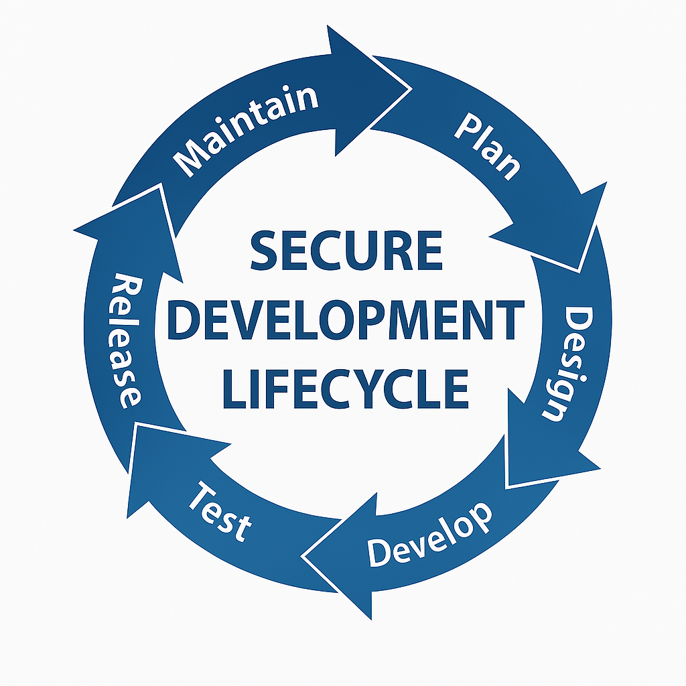

# Secure Development Lifecycle

This document describes a secure development lifecycle customized for Contoso, using the current toolchain: Bitbucket, Jenkins, JFrog Artifactory, ArgoCD, SonarQube, Black Duck, Twistlock, Jest, and Playwright.

---

## 🔁 Secure Development Lifecycle Diagram

---

## 🔐 Lifecycle Explanation (Stage by Stage)

### 🔹 Plan
- Understand business goals and user needs
- Identify data sensitivity, compliance requirements, and risk exposure
- Define DevSecOps strategy early (CI/CD flow, access control, secrets handling)

---

### 🔹 Design
- Define branching and PR strategy (e.g., `feature` → `dev` → `release`)
- Plan GitOps workflow for ArgoCD-based delivery
- Configure secure developer access (VPN + corporate proxy)
- Set up project structure and CI/CD trigger conditions (webhooks, PR rules)

---

### 🔹 Develop
- Workstation access to internal resources is controlled via **VPN** and **corporate proxy** — ensuring secure connectivity to both company systems and the internet.
- Developers push their changes to a central Git repository and open a **Pull Request (PR)** for review.
- Webhooks notify the CI system (e.g., Jenkins) to start a pipeline on push or PR merge.
- PRs must meet strict quality gates before they can be merged:
  - ✅ At least one team member must approve the changes
  - ✅ The automated build and tests must pass (triggered by the CI system)
- Use tools like **Trunk Code Quality** to run linters, formatters, and security checks automatically before code is committed.
- Pre-commit hooks such as **GitLeaks** help prevent accidental exposure of secrets.
- 🚫 Force-push (rewrite history) and branch deletion are blocked

---

### 🔹 Test

#### 🤽\ Early Stage: Versioning
- Semantic version is calculated automatically (e.g., `1.4.7 → 1.4.8`) based on Git metadata
- This version is applied to all artifacts:
  - Docker images
  - Helm charts
  - Swagger files

#### 🛠️ Build Stage
- Code is compiled or transpiled (TypeScript, Java, SCSS)
- Environment configurations are injected (e.g., `.env.production`, Helm values)
- Frontend/backend bundles are optimized (Webpack, Vite, esbuild)
- Build outputs are validated and prepared for packaging

#### 📆 Helm Chart Packaging
- Rendered using environment-specific values
- Linted and optionally tested (e.g., **helm unittest**, **chart-testing**)
- Packaged `.tgz` files are stored for later use

#### 🚣 Docker Image Build & Push
- Production-grade base images are used
- Multi-arch support enabled (`linux/amd64`, `linux/arm64`)
- Images tagged with the calculated semantic version
- Image scanned for vulnerabilities (Twistlock)
- Clean images pushed to **JFrog Artifactory**

#### 🔍 Quality & Security Checks
- Unit Tests: **Jest**
- Component Tests: **Playwright**, **SuperTest**
- E2E Tests: **Playwright**
- Static Code Analysis: **SonarQube**
- Dependency Scanning: **Black Duck**
- Image Scanning: **Twistlock**

#### 💡 Deployment Testing
- Smoke tests are performed post-deployment to a test namespace
- Verifies service readiness, environment config, and availability

#### 📅 Artifact Promotion
- Artifacts are versioned, signed, and stored in **JFrog Artifactory**
- Promotion from `dev` → `test` → `prod` only occurs if all checks pass

---

### 🔹 Release

#### 🚀 Continuous Delivery with GitOps (e.g., ArgoCD)
- Artifacts (Docker images, Helm charts) published to artifact repo
- Git commits update Helm values/K8s manifests
- **ArgoCD** syncs Git state to cluster
- Staging is deployed automatically
- Production requires manual approval or change control
- Rollbacks = Git revert + ArgoCD sync

---

### 🔹 Maintain

#### 🔎 Monitoring & Incident Response
- **Azure Monitor**, **Prometheus**, **Fluent Bit** collect telemetry
- Alerts sent on failures, vulnerabilities, unusual patterns
- Runtime issues (e.g., Twistlock alerts) trigger incident workflows
- All pipeline actions (commit, build, deploy) are logged with metadata

---

## 🏁 Summary

This Secure Development Lifecycle ensures Contoso delivers secure, high-quality, and traceable software. Each phase integrates automated testing, scanning, promotion, and deployment controls using modern CI/CD and GitOps practices.

The result is a repeatable, auditable, and safe pipeline that supports rapid innovation with confidence.
